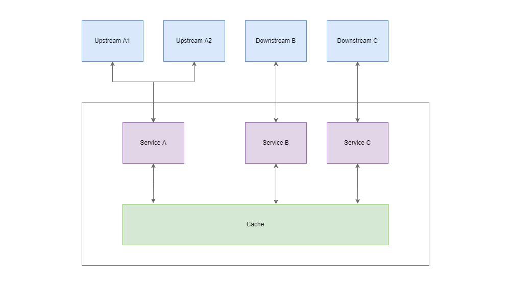

# Event-Driven Microservice Architecture

## Overview

1. Architecture
1. Data Models
1. Event Processors
1. Retry Mechanism

## Architecture

### Summary

1. Services within an application communicate internally through a cache
1. Services communicate with external upstream and downstream systems through a message queue (e.g. kafka, mq)
1. Each service contains one or more event processor
1. An event processor actively polls for new events from a data source (e.g. a cache or message queue)

## Data Models

1. Common Fields Of An Event Table
1. Common Types Of Event Tables
1. Message Types
1. Statuses

### Common Fields

An event table typically requires the following fields:

1. EVENT_ID: A universally unique identifier for each event
1. MESSAGE_TYPE: An enum that defines the type of event
1. STATUS: Used to keep track of the status of the event processing
1. CREATED_BY: Service that created the event
1. CREATED_DTTM: Timestamp when event is created
1. UPDATED_BY: Service that updated the event
1. UPDATED_DTTM: Timestamp when event is updated

Example:

| EVENT_ID | SERVICE_MESSAGE_TYPE | STATUS | CREATED_BY | CREATED_DTTM | UPDATED_BY | UPDATED_DTTM |
| - | - | - | - | - | - | - |
| a4e83689-37ee-40b3-a7db-10552d12a30d | RQ_B_STP | COMPLETED | SERVICE_A | 2019-10-12T07:20:50.52Z | SERVICE_B | 2019-10-12T07:20:50.52Z |
| a4e83689-37ee-40b3-a7db-10552d12a30d | RQ_C_POST | COMPLETED | SERVICE_B | 2019-10-12T07:20:50.52Z | SERVICE_C | 2019-10-12T07:20:50.52Z |
| a4e83689-37ee-40b3-a7db-10552d12a30d | RQ_C_POST | UNPROCESSED | SERVICE_A | 2019-10-12T07:20:50.52Z | SERVICE_A | 2019-10-12T07:20:50.52Z |

### Common Types Of Event Tables

__Inbound__

TODO

__Request, Response and Working Data__

TODO

__Payload__

| EVENT_ID | PAYLOAD | 

### Message Types

TODO

### Statuses

1. UNPROCESSED
1. IN_PROGRESS
1. COMPLETED
1. ERROR
1. RETRY
1. FAILED

## Event Processors

TODO

## Retry Mechanism

TODO
