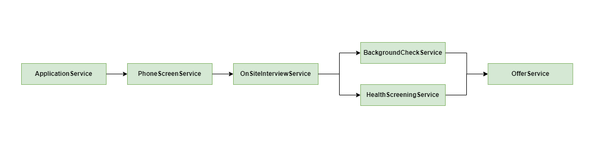

# Maintaining Workflow Statuses For An Event-Driven Microservice Architecture

## Overview

1. The Event-Driven Microservice Architecture
1. Simple (but not ideal) solution
1. The Proposed Solution: Data Model For Statuses

## The Event-Driven Microservice Architecture

Imagine that we are building a job application system using a set of microservices. This system needs to process job applications based on a defined [workflow](https://kissflow.com/workflow/what-is-a-workflow/) (i.e. a sequence/set of tasks) to completion.

For example, the set of tasks for a job application workflow may look like this:
1. __Application Form__ (Draft, Submitted)
1. __Phone Screen__ (Pending, Passed, Failed)
1. __On-site Interview__ (Pending, Passed, Failed)
1. __Background Check__ (Pending, Passed, Failed)
1. __Health Screening__ (Pending, Passed, Failed)
1. __Offer__ (Pending, Accepted, Rejected, No Offer, Rescinded)

In addition: #4 and #5 can be done in parallel.

Given the set of tasks, we may then have a set of microservices like this:

1. __ApplicationService__: Processes applications and notifies PhoneScreenService when initiated by HR
1. __PhoneScreenService__: Schedules phone screen sessions and notifies OnSiteInterviewService if passed
1. __OnSiteInterviewService__: Schedules on-site interviews and notifies BackgroundCheckService and HealthScreeningService if passed
1. __BackgroundCheckService__: Performs background checks on applicant
1. __HealthScreeningService__: Initiates health screening session for applicant
1. __OfferService__: Initiates offer to applicant after both background check and health screening are passed

## Simple (but not ideal) solution

Perhaps a simple solution is to maintain a `STATUS` column in the `APPLICATION_DETAIL` table itself. This column would show the status such as 'Submission', 'Phone Screen', 'On-site Interview', etc...

```sql
CREATE TABLE APPLICATION_DETAIL (
  ID                INT PRIMARY KEY NOT NULL,
  FIRST_NAME        CHAR(100),
  LAST_NAME         CHAR(100),
  POSITION          CHAR(100),
  STATUS            CHAR(50)
);
```

| APPLICATION_ID | FIRST_NAME | LAST_NAME | POSITION | STATUS |
| - | - | - | - | - |
| 1 | PETER | PARKER | SOFTWARE ENGINEER | SUBMISSION |
| 2 | MARY | JANE | RECRUITER | PHONE_SCREEN |
| 3 | HARRY | OSBORN | SITE RELIABILITY ENGINEER | ON_SITE_INTERVIEW |
| 4 | GWEN | STACY | ENGINERING MANAGER | ACCEPTED |

This solution may work alright if:
1. Each task do not need sub-statuses (e.g. Pending, Passed, Failed)
1. Each task is executed in sequence (i.e. only one task is pending at any given time)

We quickly observe that this would not work well for our job application system given that:
1. Each task has multiple sub-statuses (e.g. Pending, Passed, Failed)
1. A single status cannot show
    - when multiple tasks are pending in parallel
    - an overview status of all the microservices

## The Proposed Solution: Data Model For Statuses

Using a table to maintain the statuses of all your microservices:
```sql
CREATE TABLE APPLICATION_STATUS (
  ID                            INT FOREIGN KEY NOT NULL, 
  PHONE_SCREEN_STATUS           CHAR(50),
  ON_SITE_INTERVIEW_STATUS      CHAR(50),
  BACKGROUND_CHECK_STATUS       CHAR(50),
  HEALTH_SCREENING_STATUS       CHAR(50),
  OFFER_STATUS                  CHAR(50)
);
```

| APPLICATION_ID | PHONE_SCREEN_STATUS | ON_SITE_INTERVIEW_STATUS | BACKGROUND_CHECK_STATUS | HEALTH_SCREENING_STATUS | OFFER_STATUS |
| - | - | - | - | - | - |
| 1 | PENDING |  | | | PENDING |
| 2 | COMPLETED | COMPLETED | PENDING | PENDING | |
| 3 | COMPLETED | COMPLETED | FAILED | CANCELLED | NO_OFFER |
| 4 | COMPLETED | COMPLETED | COMPLETED | COMPLETED | ACCEPTED |
